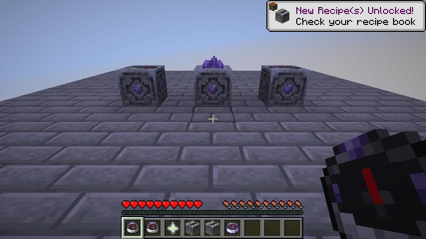
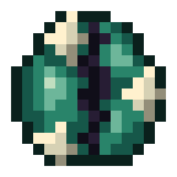
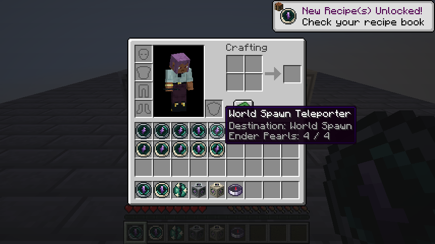
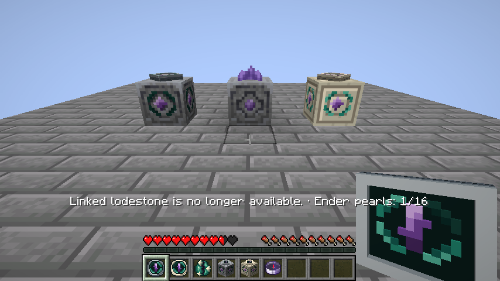
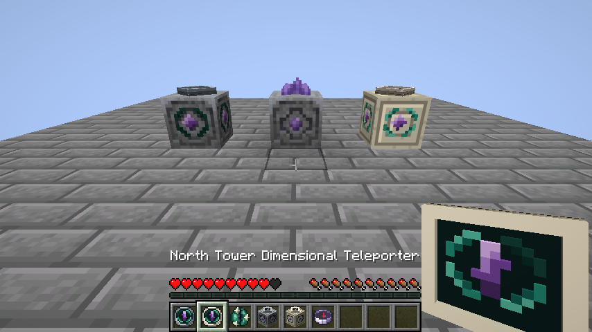
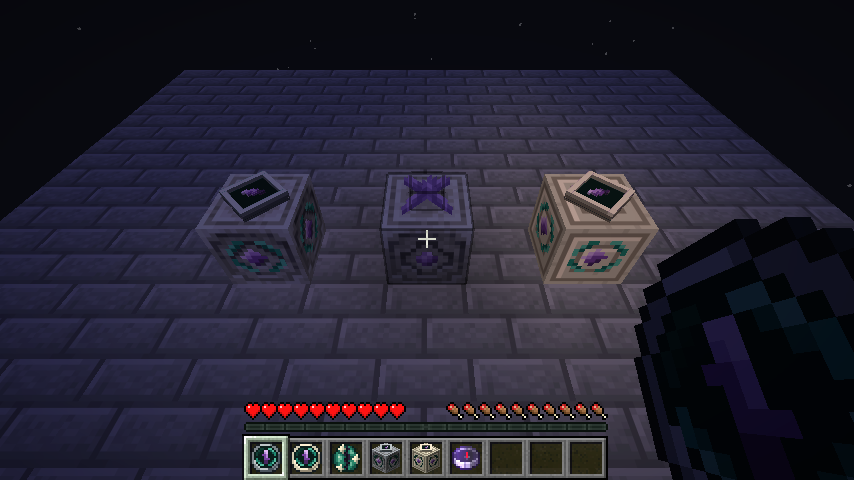

# Lodestone Transit

[](https://github.com/R3Neer/lodestone-transit/actions/workflows/build.yml)

Fast travel built from Minecraft's own navigation systems: compasses define destinations, lodestones anchor them, and ender pearls power the journey.

A Fabric mod for **Minecraft 26.2**, requiring **Fabric API**, **Fabric Loader 0.19.5+** and **Java 25**. Install the mod on both the client and server. Version **0.1.0-beta.2** is a beta under active human playtesting.

There are no waypoint menus, destination lists, energy networks or teleport commands. Make a device from a compass, carry pearls, and keep its physical anchor intact.



In-game screenshots from the current development build. From left to right: Teleport Station, Calibrated Lodestone and Dimensional Teleport Station. Each station holds 16 pearls, shown by four curved fragments around the amethyst on each side.

## Highlights

- Guides a compass-bound player to spawn, a named lodestone, or their last death position.
- Supports four-pearl portable devices and sixteen-pearl teleport stations.
- Keeps anchors stable when lodestones move, using UUID-based identities and player-visible names.
- Carries the player's mounted and leashed entities when the destination is valid.
- Preserves the distinction between normal travel and explicitly enabled cross-dimensional travel.

## Navigation and portable use

The compass used in crafting determines the destination:

| Compass | Destination |
| --- | --- |
| Ordinary compass | Current world spawn, resolved when used |
| Lodestone compass | That specific lodestone's persistent identity |
| Recovery compass | The activating player's most recent death, including its dimension |

A portable Teleporter holds **four Ender Pearls**. Hold the device and pearls in opposite hands, then sneak and right-click to insert one pearl. Both hand arrangements work. Select the device and hold it for **20 ticks (about one second)** until ready; right-click then teleports immediately. Readiness remains while held, damage does not reset it, and reselection restarts it. There is no cooldown after travel.

Creative-menu teleporters also target the current world spawn, like an unbound compass. Existing devices with a missing destination are repaired, but a broken lodestone link is never redirected to spawn.

The tooltip shows the exact pearl count from **0 / 4** to **4 / 4**, alongside the destination; the texture also shows the individual loaded fragments.

A normal Teleporter only works within the destination's dimension. A **Dimensional Teleporter** can also travel between the Overworld, Nether, End and valid modded dimensions, using the same single pearl per attempt.

Right-click either portable device on a lodestone to change its link without spending fuel or losing its manual name. Travel requires a **Calibrated Lodestone**. Linking to a normal lodestone succeeds, but the action bar explains that teleportation is unavailable. Recovery-crafted devices are named **Recovery Teleporter** and **Dimensional Recovery Teleporter**; they use exactly the same artwork and 3D model as the corresponding ordinary Teleporter, while their needles point to the player's last death. Relinking changes them to the corresponding lodestone-targeted device.

The hotbar shade and crosshair indicator share the server's per-hand readiness state. Failure messages appear briefly in the action bar, not chat, and distinguish the reason (empty fuel, warming up, invalid or uncalibrated anchor, moving anchor, missing death, unavailable or wrong dimension, unsafe arrival, and passenger restrictions). [Full message list](docs/ACTION-BAR-MESSAGES.md).

**Fuel is spent before the destination is checked.** A broken anchor, missing death, wrong dimension or blocked arrival still costs one pearl and applies vanilla Ender Pearl damage. There are no refunds. An empty device or an unarmed portable device cannot start an attempt. Only the activating player takes the damage.

## Recipes

Crafting is component-aware: linked destinations, manual names and relevant item data survive conversion and upgrades. Recipes have vanilla recipe-book displays and unlock when you acquire their relevant ingredients.

### Calibrated lodestone

This crafts the new `lodestone_transit:calibrated_lodestone`. The vanilla lodestone keeps its original recipe and appearance:

```text
C A C    C = Chiseled Stone Bricks
C I C    A = Amethyst Shard
C C C    I = Iron Ingot
```

Seven chiseled stone bricks, one amethyst shard and one iron ingot. A small amethyst bud crowns the vanilla stone body, with purple inlays at the centers of its sides. Existing ordinary lodestones are not converted automatically.

### Teleporter

```text
E A E    E = Eye of Ender
E C E    A = Amethyst Shard
E E E    C = Compass or Recovery Compass
```

Seven eyes of ender, one **Amethyst Shard** (`minecraft:amethyst_shard`, the dropped fragment, not a bud or cluster) and one compass. A linked vanilla compass is accepted, including one created before installing this mod if its lodestone still exists. Its destination still needs calibration before it can be used for travel.

### Dimensional upgrade

Without Alex's Mobs Continued, craft a **Dimensional Core**:



An Eye of Ender split by a dark dimensional fissure and held by three ivory Nether Star fragments. The native texture is 16 × 16; the preview above is enlarged without smoothing. [See the Core in-game](docs/images/dimensional-core-in-game.png).

```text
E E E    E = Eye of Ender
E N E    N = Nether Star
E E E
```

Combine a Teleporter and the Core anywhere in the crafting grid. The result is a Dimensional Teleporter with the same destination, name and stored pearls. The Core remains in the grid, uses exactly one of its **20 uses**, and breaks on its last use.

If `alexsmobs:dimensional_carver` is registered, use that **Dimensional Carver** instead. Each upgrade costs exactly **one durability point**, preserves the rest of the Carver, and hides the alternative Core recipe and creative entry. Alex's Mobs Continued is optional.

### Teleport stations

```text
C C C    C = Chiseled Stone Bricks
C T C    T = Teleporter or Dimensional Teleporter
C C C
```

The station permanently incorporates its device. A dimensional device produces a dimensional station. Destination, custom name, relevant metadata and the device's existing pearls are preserved. There is no destination-switching slot.

A station made from a spawn-targeted Teleporter also targets the current world spawn. Stations from the Creative menu have the same default, including dimensional stations. Existing stations without destination data use spawn; broken lodestone links remain broken.

Stations have one inventory slot accepting up to **16 Ender Pearls**:

- Right-click with a pearl in either hand to insert one. An offhand pearl loads the station even with an empty main hand or another item held there; if both hands hold pearls, the main hand supplies one. Loading takes precedence over travel. The action bar shows the resulting stored count, such as **Ender pearls: 3/16**.
- A full station rejects the pearl with a distinct sound and **Ender pearls: 16/16 · Full**. An empty station uses a hollow decorated-pot sound and **Ender pearls: 0/16 · Empty**.
- Travel reports the remaining count; a failed journey keeps its specific reason alongside that count.
- Right-click without a pearl to attempt travel immediately; stations need no arming.
- Hoppers can insert and extract pearls. Other items are rejected.
- Comparators use vanilla container fullness: empty is 0, one pearl is 1, eight are 8, and sixteen are 15.
- Breaking a station drops its destination-bearing item and drops its stored pearls separately.

Redstone does not activate a station.

## Physical anchors and names

Each linked lodestone has a persistent UUID. This mod permits pistons to move lodestones and updates their identity's position using the actual piston movement. Linked compasses, portable devices and stations follow the same anchor. Stored compasses resolve the new position when available, without scanning every inventory.

Breaking a lodestone permanently invalidates its identity. Placing a new lodestone at exactly the same coordinates does **not** repair the old links. Moving and breaking/replacing are different operations.

Use an anvil-renamed Name Tag on a lodestone to name its anchor. The tag is consumed outside Creative, with no additional XP charge. Linked items automatically use translated names such as “Home Teleporter” or “Teletransportador de Home”. Renaming the anchor updates those automatic names. An anvil name on an individual device takes precedence; its destination tooltip continues to show the anchor name.

## Arrival, mounts and leads

Arrival searches within five blocks of the destination using the entities' actual bounding boxes. It rejects solid collisions, world-border violations and vertical-limit violations. Among valid candidates it prefers more foot support, more clearance and shorter distance, with strong penalties for environmental hazards. This is a bounded geometric search, not an assessment of enemies or lighting. It does not guarantee a hazard-free arrival when all available geometry is dangerous.

The player's mount and its passenger hierarchy are essential: they travel together, and insufficient space cancels the entire main trip. Connected lead chains are traversed recursively with cycle protection. Secondary entities try separate positions within three blocks of the main arrival. If one cannot fit, it and its dependent subtree stay behind; only the boundary lead breaks. Cross-dimensional travel reconstructs valid leash relationships with the destination entity instances.

No permanent chunk loader is installed. Successful arrivals use vanilla temporary portal tickets, expiring after 300 ticks.



The hand-painted 16 × 16 inventory sprites: normal teleporters in the upper row and dimensional teleporters below. Each row shows zero through four pearls, from left to right; the green fragments fill individually.

## Optional compatibility

- **p1kl's 3D Items:** the included **Lodestone Transit: p1kl’s 3D Items** bridge is always enabled and automatically uses the external p1kl pack when it is present. The original teleporter models match its compass's 9 × 9 × 2 body dimensions, with a moving amethyst pointer and four curved charge fragments. Inventory icons retain their round, 16 × 16 pixel silhouette. No external textures or models are bundled. If p1kl is disabled, the bridge selects the regular flat models. The vp26 version is `GaCryZnJ`.

- **Pushier Pistons 1.0-mc26.2 / FrozenLib 2.5.3-mc26.2:** stations opt into FrozenLib's `has_pushable_block_entity` tag so its normal movement preserves their data and inventory.
- **Alex's Mobs Continued:** registry-based Dimensional Carver integration; no hard dependency or copied code/assets.
- **Entity size mods:** landing reads actual bounding boxes instead of assuming player dimensions.
- **Ender Pearl damage mods:** damage uses the vanilla `enderPearl()` source and 5-point amount. General damage-source hooks apply; a mod that injects only into the thrown projectile's private impact method will not automatically affect this device.
- **Combat mods:** readiness uses an independent server timer and slot-change observation, not the attack-strength timer. An optional mod that overwrites the same packet or piston internals may still require an integration update.

With p1kl's 3D Items installed, the normal Teleporter has an iron frame:



The Dimensional Teleporter uses an ivory frame. Both retain the round inventory icon:



See [verification and playtesting](docs/TESTING.md) for the exact tested versions and remaining human checks.

## Develop in IntelliJ IDEA

1. Install a **JDK 25** and select it as both the Project SDK and the Gradle JVM in IntelliJ IDEA.
2. Choose **File → Open** and select this repository's `build.gradle` file (or its root directory), then import it as a Gradle project.
3. Wait for the Gradle sync to finish. In the Gradle tool window, run **Tasks → fabric → runClient** to launch the development client.

The client uses the project's generated `run/` directory for its instance and automatically loads the mod from the source set. Stop it, change the code, and start `runClient` again to test the next build. `runClientGameTest` starts the client GameTest environment; it is separate from normal manual playtesting.

## Build and tests

With JDK 25 installed:

```sh
./gradlew build
./gradlew runClientGameTest
```

On Windows, use `gradlew.bat`. `build` includes unit tests and dedicated-server GameTests. The distributable is `build/libs/lodestone-transit-0.1.0-beta.2.jar`; the sources JAR is separate. CI runs the server-side build and tests on Java 25.

To run the same integration suite with locally installed optional mod JARs and their dependencies:

```sh
./gradlew runGameTest -PcompatModsDir=/absolute/path/to/optional-mods
```

Those JARs are neither bundled nor required for a normal build. The teleporter artwork was painted at 16 × 16 in Piskel using its drawing tools through computer use. Editable originals and individual layers are checked in under [art/piskel](art/piskel). `python tools/craft_visuals.py` assembles those layers, generates the compass's nearest-neighbour rotations and extrudes their pixels into 3D relief; it does not draw the artwork. Normal builds do not need Python. Vanilla block textures are referenced by identifier, not redistributed.

Portable teleporters show zero to four pearls as individual beveled fragments in their texture. Stations show sixteen separate fragments around the amethysts on their four lateral faces, four per face; the instrument on top carries the pointer. The block updates its appearance when pearls are inserted or removed, including through hoppers. See the [art workflow](art/piskel/README.md) for source files and editing details.

Placed stations also emit ordinary Minecraft block light for each complete group of four pearls:

| Loaded pearls | Teleport Station | Dimensional Teleport Station |
| --- | --- | --- |
| 0–3 | 0 | 0 |
| 4–7 | 1 | 2 |
| 8–11 | 2 | 4 |
| 12–15 | 3 | 6 |
| 16 | 4 | 8 |



Both stations contain 16 pearls: the normal station on the left emits light level 4, while the dimensional station on the right emits level 8.

Light updates automatically when pearls are loaded or consumed; no dynamic-light mod is required for placed stations. Portable teleporters do not emit dynamic light: Minecraft Java 26.2 has no universal item-luminosity component. The installed vp26 provider, LambDynamicLights 4.12.4, automatically derives light from block items, but regular items need its [item-light JSON definitions or API](https://lambdaurora.dev/projects/lambdynamiclights/docs/v4/item.html). Adding those would be provider-specific compatibility, so they are deliberately omitted. Merely making a model emissive would brighten its surface without illuminating the surroundings.

Architecture and mixin boundaries are documented in [ARCHITECTURE.md](docs/ARCHITECTURE.md). English and Spanish (Spain) translations are included. The repository's original [GPLv3 license](LICENSE) is retained.

Release changes and update instructions are in [CHANGELOG.md](CHANGELOG.md). Substantial code, text and artwork were produced by an AI agent under human direction; see [provenance and credits](docs/PROVENANCE.md).

Not an official Minecraft product. Not approved by or associated with Mojang or Microsoft.
