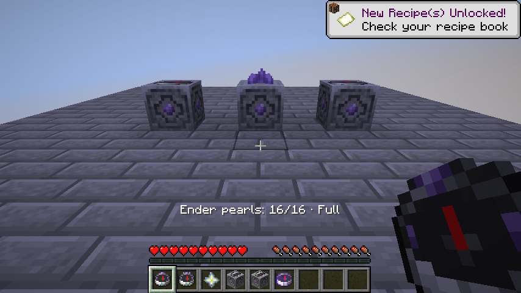

# Gameplay messages (specified before implementation)

All messages are localized action-bar overlays, never chat. Linking/loading is not a travel attempt. Empty or unready devices do not spend fuel. Once a ready, fueled attempt begins, fuel and vanilla pearl damage apply even when destination validation fails.

| Situation | English | Spanish |
| --- | --- | --- |
| Still arming | Teleporter is still warming up. | El teletransportador aún se está preparando. |
| Empty portable or station | No ender pearls. Load a pearl to teleport. | No quedan perlas de ender. Carga una para teletransportarte. |
| Missing destination | No destination linked. | No hay ningún destino enlazado. |
| Unknown, destroyed or invalid anchor | Linked lodestone is no longer available. | La magnetita enlazada ya no está disponible. |
| Ordinary lodestone target | Linked lodestone is not calibrated. Teleportation unavailable. | La magnetita enlazada no está calibrada. Teletransporte no disponible. |
| Anchor currently moving | Linked lodestone is moving. Try again when it stops. | La magnetita enlazada se está moviendo. Inténtalo cuando se detenga. |
| Recovery without death | No last death location is available. | No hay una ubicación de última muerte disponible. |
| Destination dimension missing | The destination dimension is unavailable. | La dimensión de destino no está disponible. |
| Normal device across dimensions | Destination is in another dimension. A dimensional teleporter is required. | El destino está en otra dimensión. Necesitas un teletransportador dimensional. |
| Activator dead/removed/spectating | You cannot teleport in your current state. | No puedes teletransportarte en tu estado actual. |
| Activator sleeping | Wake up before teleporting. | Despiértate antes de teletransportarte. |
| No safe arrival for player | No safe arrival space near the destination. | No hay un lugar de llegada seguro cerca del destino. |
| No safe arrival for mount/passengers | Not enough safe arrival space for your mount and passengers. | No hay espacio de llegada seguro para tu montura y sus pasajeros. |
| Essential entity cannot travel | Your mount or a passenger cannot travel to this dimension. | Tu montura o uno de sus pasajeros no puede viajar a esta dimensión. |
| Transfer returned no entity | Teleportation could not be completed. | No se ha podido completar el teletransporte. |
| Secondary leash group left behind (partial success) | Some leashed entities could not follow you. | Algunas entidades atadas no han podido acompañarte. |
| Broken station block entity | This teleport station is unavailable. | Esta estación de teletransporte no está disponible. |
| Duplicate activation same tick | Ignore duplicate; preserve the first activation's message. | Ignorar el duplicado y conservar el mensaje de la primera activación. |
| Fuel full (loading feedback) | Ender pearl storage is full. | El depósito de perlas de ender está lleno. |
| Link to ordinary lodestone | Linked to uncalibrated lodestone. Teleportation unavailable. | Enlazado a una magnetita sin calibrar. Teletransporte no disponible. |
| Link to calibrated lodestone | Linked to calibrated lodestone. | Enlazado a una magnetita calibrada. |

Successful travel keeps its existing sound and particles. No generic failure message should overwrite a more specific reason. Unexpected programming exceptions must remain visible in logs rather than being silently swallowed.

## Container feedback revision (2026-09-06)

Specified before implementation: station interactions report the stored pearls,
not the pearls in the player's inventory. Insertion reports the resulting count;
travel reports the count after debit. A specific travel failure remains in the
same overlay alongside the count, rather than being overwritten by it.

| Situation | English | Spanish | Sound |
| --- | --- | --- | --- |
| Insert / successful use | Ender pearls: 3/16 | Perlas de ender: 3/16 | Existing insertion / travel sound |
| Use empty station | Ender pearls: 0/16 · Empty | Perlas de ender: 0/16 · Vacío | Decorated pot insert fail |
| Insert into full station | Ender pearls: 16/16 · Full | Perlas de ender: 16/16 · Lleno | Bundle insert fail |
| Fueled travel fails | Specific reason · Ender pearls: 2/16 | Motivo concreto · Perlas de ender: 2/16 | Existing travel-failure sound |

An empty portable uses the same hollow pot feedback; a full portable uses the
bundle insertion-rejection sound. Neither case emits teleport-failure particles.

Minecraft's [creator guidance on sound](https://learn.microsoft.com/en-us/minecraft/creator/documents/designinggameplayforvariousdevices#sound)
says essential information must remain understandable without hearing the audio.
This is Bedrock creator guidance, not a Java action-bar format specification.
The exact counter wording above is our design choice applying that principle to
the requested action bar. Mojang's [decorated-pot notes](https://feedback.minecraft.net/hc/en-us/articles/20298295897229-Minecraft-Java-Edition-Snapshot-23w41a)
provide the no-GUI container precedent. The actual 26.2 DecoratedPotBlock uses
DECORATED_POT_INSERT_FAIL for unsuccessful/empty-hand interaction; there is no
separate sound event named decorated-pot-empty. BUNDLE_INSERT_FAIL is the
separate vanilla full-container rejection selected here.

